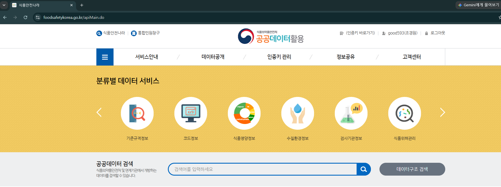
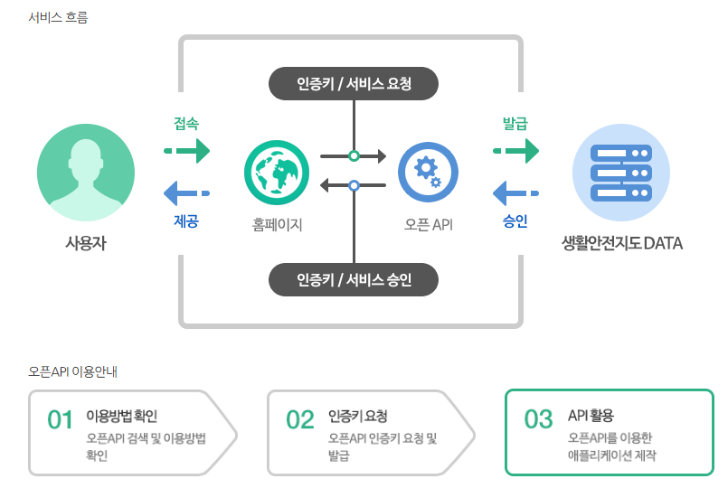
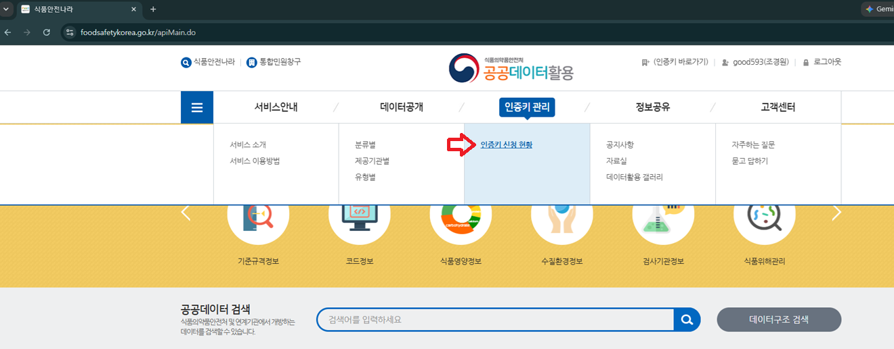
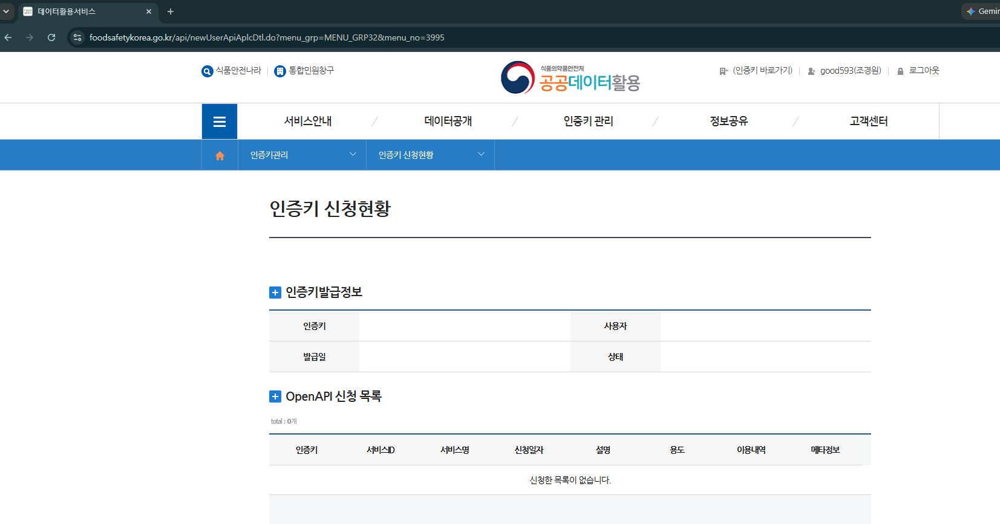
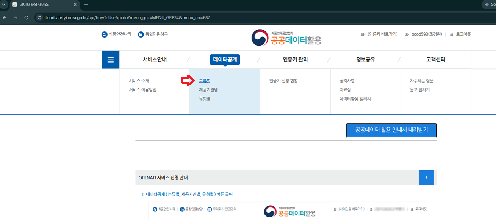
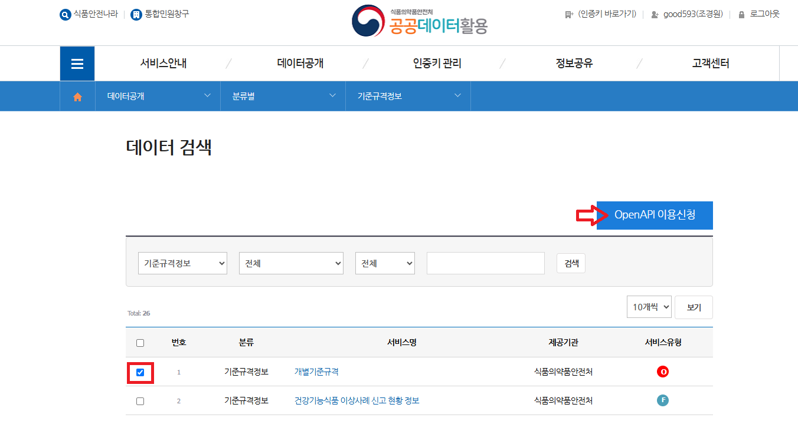
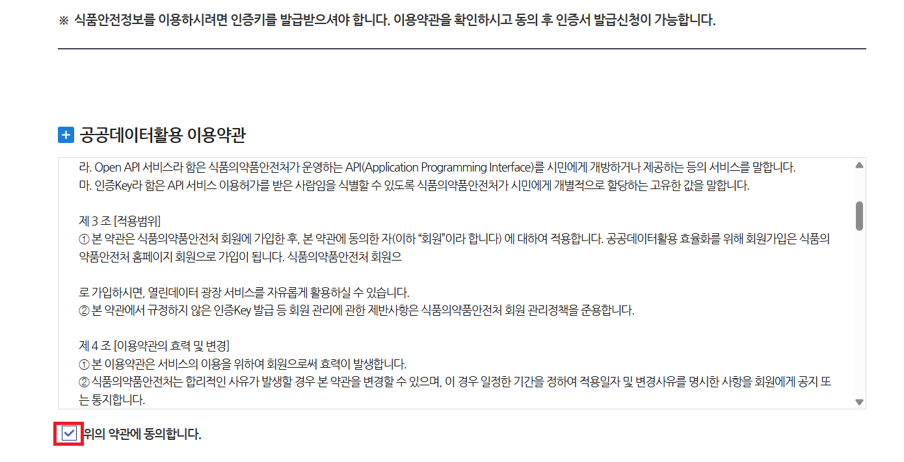
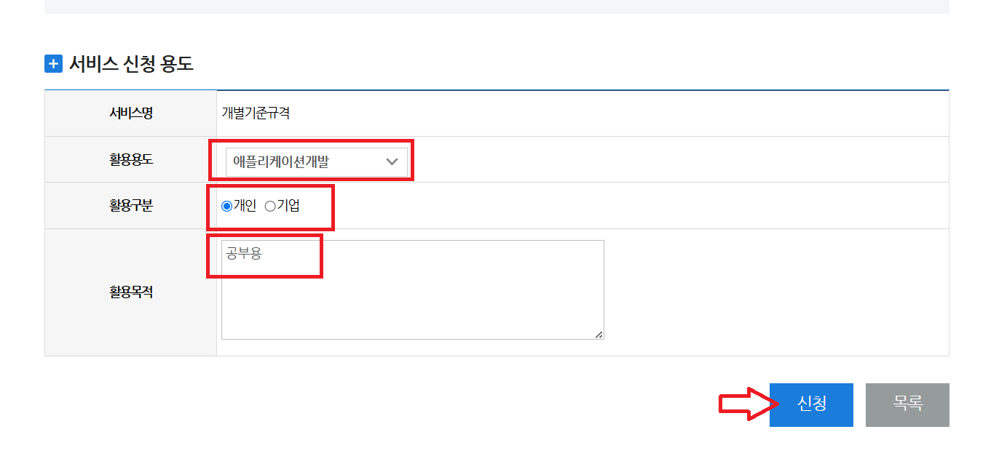
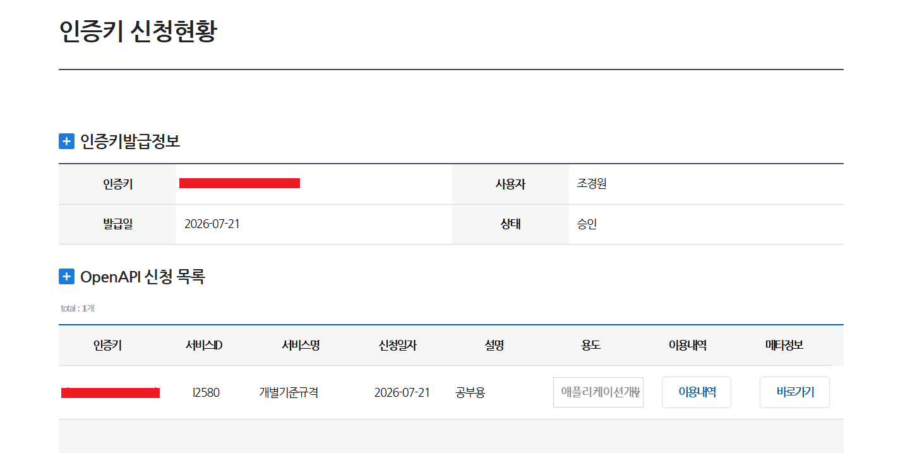

# 공공데이터활용 - 인증키 생성

---
## [식품의약품안전처 접속](https://www.foodsafetykorea.go.kr/apiMain.do)

---
## [인증키](https://www.safemap.go.kr/dvct/openAPI.do) 
인증키(API Key)는 "이 요청을 보낸 사람이 누구인지 확인하기 위한 고유한 비밀번호 같은 문자열"입니다.

> 쉽게 말하면, 서비스를 이용할 수 있는 출입증이라고 생각하면 됩니다.

---

---
### 왜 필요한가? 

| 목적     | 설명               |
| ------ | ---------------- |
| 사용자 식별 | 누가 API를 사용하는지 확인 |
| 보안     | 허가된 사용자만 접근 가능   |
| 사용량 관리 | 하루 호출 횟수 제한 등 적용 |
| 과금     | 사용량에 따라 비용 계산    |

---
### 인증키 관리

---

---
### [인증키 신청](https://www.foodsafetykorea.go.kr/api/howToUseApi.do?menu_grp=MENU_GRP34&menu_no=687) 

---

---

---

---

